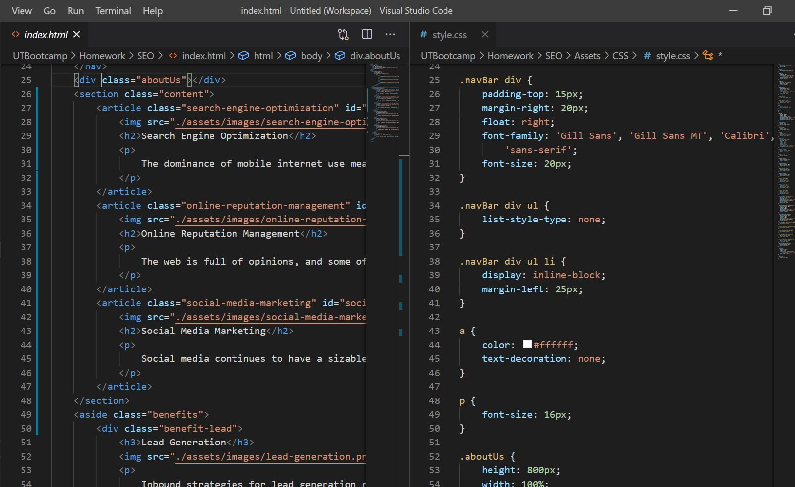
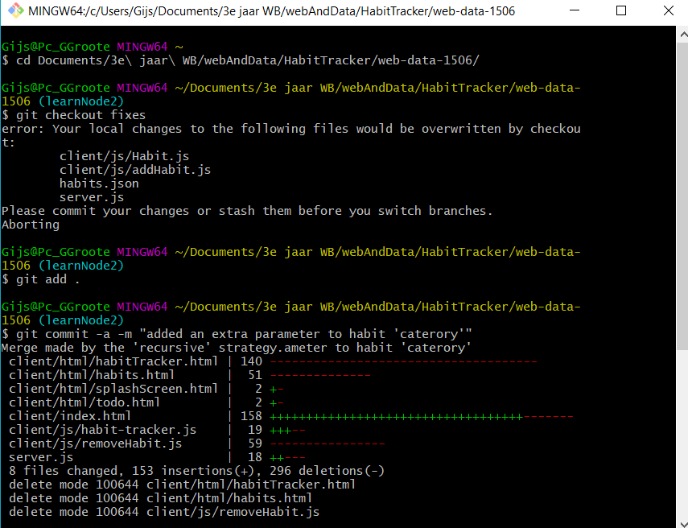

# SEO Improvements
#### Table of Contents
* [About](#About)
* [Installation](#Installation)
* [Usage](#Usage)
* [Contribution](#Contribution)
* [License](#License)

# About
The SEO Repository was created to improve a HTML and CSS semantics, syntax, and errors within another User's HTML/CSS file. This source code is available to everyone under the standard [MIT License](https://github.com/microsoft/vscode/blob/master/LICENSE.txt).

# Installation
To install please visit [my repository](https://github.com/lexcraw4d/SEO) and look at the uploaded files.

# Usage
##### Visual Studio Code

Visual Studio Code (VS) was used to edit and improve the functionality of the given SEO website.

[Visual Studio Code](https://code.visualstudio.com/) is an lightning fast FREE open-source editor designed by [Microsoft](https://www.microsoft.com/en-us/) with developers in mind. Visual Studio code allows developers to easily apply the edit-build-debug cycle, resulting in more productivity on your ideas.

[Visual Studio Code](https://code.visualstudio.com/) brings all that you need as a developer, such as: debugging, instant editing results, customization specifically designed for your preference, hundreds of languages, extensions, version control, and more all at your fingertips!

##### GitHub/Git

In order to make effective changes to the website both [Git](https://gitforwindows.org/) and [GitHub](https://github.com/) were used in synchronization to push commits of the latest updated version. 

Git is version control system which allows multiple users to make changes to one single repository.

GitHub is a corporation which provides hosting for version control Git and software development. [GitHub Docs ](https://docs.github.com/en/free-pro-team@latest/github/setting-up-and-managing-your-github-user-account/managing-user-account-settings) provides all needs for setting up your GitHub and answering problem-solving issues you may come across while using GitHub.

# Contribution
Feel free to contribute to this project in any of the following ways: 
* [Submit bug and feature requests](https://github.com/lexcraw4d/SEO/issues)
* [Review Source Code Changes](https://github.com/lexcraw4d/SEO/pulls) and make pull requests from typos to content
* For specific concerns that do not meet the above please do not hesitate to reach out to me via [My GitHub](https://github.com/lexcraw4d).

If you are interested in fixing issues directly to the code base, please reference the [How to Contribute](https://github.com/microsoft/vscode/wiki/How-to-Contribute) article.

# License

Copyright (c) 2020 Lexie Crawford

Licensed under the [MIT License](https://github.com/lexcraw4d/SEO/blob/master/LICENSE)

